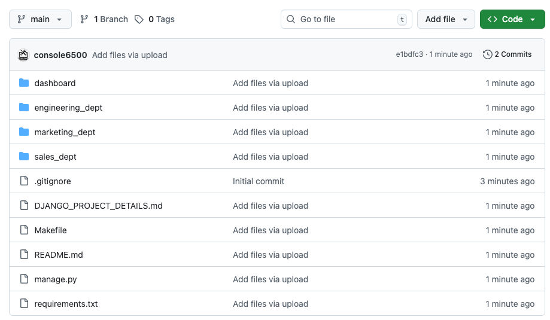

# 01_06 Solution: Build a CI Workflow for a Python Project

In this challenge, you’ll create a **continuous integration (CI) workflow** for a Django application using **GitHub Actions**. You’ll start from a brand-new repository, add the project files, configure a starter workflow, and debug a failing build until the workflow completes successfully.

By the end of this challenge, you’ll have hands-on experience using GitHub Actions starter workflows, updating workflow configurations, and diagnosing common CI failures.

## Challenge tasks

To complete this challenge, you will:

- Create a new GitHub repository for a Django project
- Upload project files while preserving directory structure
- Configure a Django CI workflow using a starter template
- Update Python versions and GitHub Action versions
- Observe, diagnose, and fix a failing workflow
- Trigger and verify a successful CI run

This challenge should take 15 to 20 minutes to complete.

## Prerequisites

Before you begin, make sure you have:

- The exercise files for this lesson downloaded locally

## Instructions

### Step 1: Create a New GitHub Repository

1. Log in to your GitHub account.
2. Create a **new repository**.
3. Enter a repository name of your choice.
4. Add a description such as "Django CI project".
5. Set the repository visibility to **Public**.
6. Select **Add a README file**.
7. Choose **Python** as the repository language (if prompted).
8. Select **Create repository**.

### Step 2: Upload the Exercise Files

1. From the repository page, select **Add file → Upload files**.
2. Using your local file system explorer, **drag and drop all exercise files** into the upload area.
3. Ensure the files are uploaded together so the directory structure is preserved.
4. Verify the repository includes:

    - Subdirectories for:

        - `dashboard`
        - `engineering`
        - `marketing`
        - `sales`

    - Top-level files such as:

        - `manage.py`
        - `requirements.txt`

    

5. Commit the uploaded files to the `main` branch.

> [!IMPORTANT]
> Django projects rely on a specific directory structure. Uploading files individually can break imports and test execution.

### Step 3: Create a CI Workflow Using a Starter Template

1. Select the **Actions** tab in your repository.
2. GitHub should detect that this is a Django project and suggest workflows.
3. Locate the **Django** starter workflow.
4. Select **Configure** to open the workflow editor.

### Step 4: Update the Workflow Configuration

In the workflow file:

1. Update the **Python version matrix** to use:

    - `3.11`
    - `3.12`
    - `3.13`
    - `3.14`

    _Note that newer versions may be available when you complete the challenge._

2. Update the GitHub Actions versions to the latest available version:

    - `actions/checkout` → `v6`
    - `actions/setup-python` → `v6`

    _Note that newer versions may be available when you complete the challenge._

3. Save your changes by committing the workflow **directly to the `main` branch**.

### Step 5: Observe the Initial Workflow Run

1. After committing, navigate back to the **Actions** tab.
2. Select the running workflow.
3. Observe the job executions for each Python version.

At this stage, the workflow is expected to **fail**.

### Step 6: Debug the Workflow Failure

1. Open the log for the failed job.
2. Locate the failure in the **Run tests** step.
3. Identify the error indicating that **`numpy` is not installed**.

### Step 7: Fix the Dependency Issue

1. Return to the **Code** tab.
2. Select the `requirements.txt` file.
3. Select the pencil icon to edit the file.
4. Add the following dependency:

    ```bash
    numpy
    ```

5. Commit the change directly to the `main` branch.

### Step 8: Verify a Successful Workflow Run

1. Navigate back to the **Actions** tab.
2. Observe the newly triggered workflow run.
3. Confirm that **all jobs complete successfully** across the Python version matrix.

## Challenge Completion

1. Review the tasks in this challenge.
2. Consider how the steps mirror a real-world continuous integration workflow.
3. Consider how GitHub Actions can support rapid feedback during software development.

### Optional Reflection

1. Why is testing against multiple software versions valuable?
2. How would you extend this workflow to include the following?

    - linting
    - code coverage
    - security scans

When you’re ready, move on to the next chapter!

<!-- FooterStart -->
---
[← 01_05 Challenge: Build a CI Workflow for a Python Project](../01_05_challenge_ci_workflow/README.md) | [02_01 Deliver Software artifacts and Packages →](../../ch2_delivery/02_01_deliver_software_artifacts/README.md)
<!-- FooterEnd -->
