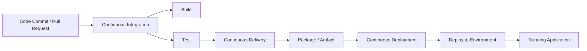

# 03_01 Deploying Software with Github actions

**Continuous Deployment** extends the CI/CD pipeline by automatically placing tested artifacts into live systems where they can be run and operated.

Following are some key points to keep in mind when building deployment pipelines in GitHub Actions.

| GitHub Actions Keyword / Configuration | Details |
| -------------------------------------- | ------- |
| **`environment: ENVIRONMENT_NAME`** | Defines a named deployment target referenced in a job using the. Creating environments in the GitHub UI enables full control over rules, variables, and secrets before deployment workflows run. |
| **`concurrency: ENVIRONMENT_NAME`** | Prevents overlapping deployments by ensuring only one workflow or job deploys to a given environment at a time. |
| **Protection rules** | Restrict deployments to specific branches and optionally require approval before a deployment proceeds. |
| **Environment variables** | Environment-level variables override repository values, allowing the same workflow to be reused across multiple environments. |
| **Repository variables** | Provide default configuration values that can be shared across workflows and overridden by environments when needed. |
| **Secrets** | Store sensitive data such as access keys and passwords required for external deployments. |

> [!IMPORTANT]
> Environments, environment secrets, and deployment protection rules are available in public repositories for all current GitHub plans. They are not available on legacy plans, such as Bronze, Silver, or Gold. For access to environments, environment secrets, and deployment branches in private or internal repositories, you must use GitHub Pro, GitHub Team, or GitHub Enterprise. If you are on a GitHub Free, GitHub Pro, or GitHub Team plan, other deployment protection rules, such as a wait timer or required reviewers, are only available for public repositories.  See the [references](#references) for more details.

## References

| Reference | Description |
|----------|-------------|
| [Deploying with GitHub Actions](https://docs.github.com/en/actions/how-tos/deploy/configure-and-manage-deployments/control-deployments) | Explains how to configure and manage deployment workflows in GitHub Actions, including controlling deployment targets and approvals. |
| [Managing environments for deployment](https://docs.github.com/en/actions/how-tos/deploy/configure-and-manage-deployments/manage-environments) | Describes how to create, configure, and protect environments used for deployments in GitHub Actions. |
| [Viewing deployment history](https://docs.github.com/en/actions/how-tos/deploy/configure-and-manage-deployments/view-deployment-history) | Shows how to review past deployments, track status, and view history logs for workflows. |
| [Deploying to third-party platforms](https://docs.github.com/en/actions/how-tos/deploy/deploy-to-third-party-platforms) | Covers connecting GitHub Actions with external platforms or services such as AWS, Azure, or Firebase for automated deployments. |
| [Approve or reject jobs awaiting review](https://docs.github.com/en/actions/how-tos/deploy/configure-and-manage-deployments/review-deployments) | Details the approval process for protected deployments, including how reviewers can approve or reject pending deployment jobs. |

<!-- FooterStart -->
---
[← 02_05 Solution: Develop a Container Image Workflow](../../ch2_delivery/02_05_solution_container_workflow/README.md) | [03_02 Continuous Deployment for Github Pages →](../03_02_cd_for_github_pages/README.md)
<!-- FooterEnd -->
