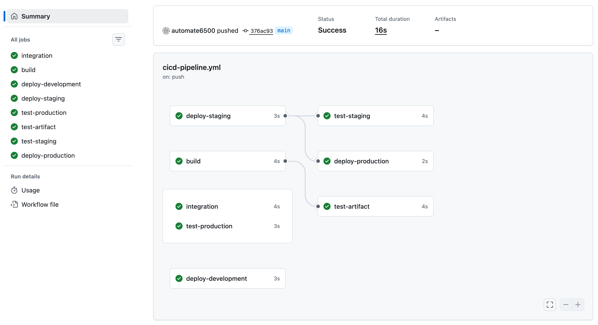
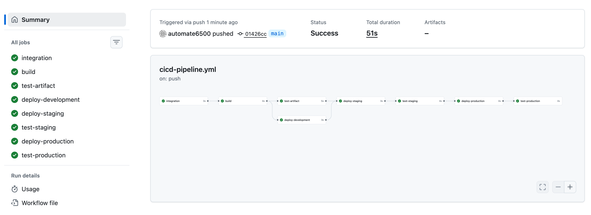
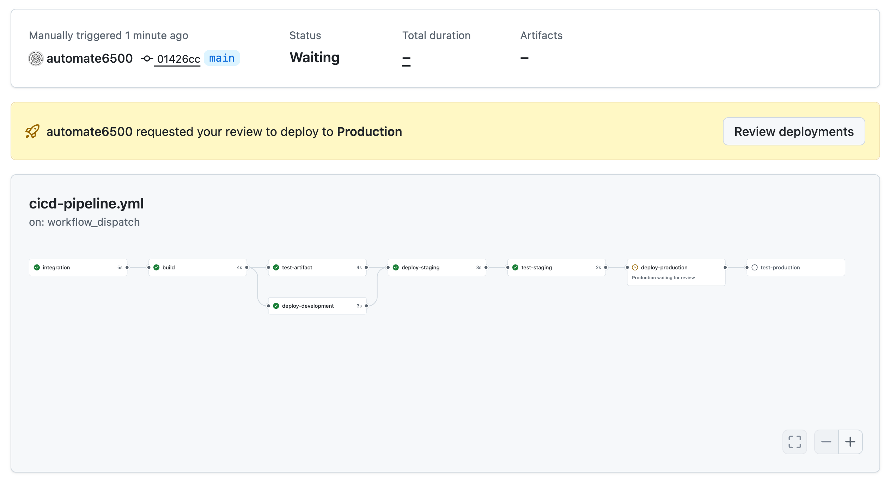

# 03_07 Solution: Build a Full CI/CD Pipeline

In this challenge, you’ll take a **misconfigured CI/CD pipeline** and transform it into a **clear, ordered continuous deployment workflow**. The pipeline already includes jobs for integration, artifact creation, testing, and deployments to multiple environments—but the jobs run **out of order** and lack **deployment protection** for production.

Your task is to correct the execution flow by adding job dependencies and then secure the production deployment using a **protected environment with required approvals**.

By the end of this challenge, you’ll have a working pipeline that progresses cleanly from commit to production and pauses for manual approval before deploying to a protected environment.

## Challenge Tasks

To complete this challenge, you will:

- Create a new GitHub repository for the exercise
- Upload the provided pipeline and README files
- Move the workflow into the correct GitHub Actions directory
- Observe an incorrectly ordered pipeline execution
- Add job dependencies to create a proper deployment flow
- Configure a protected production environment
- Verify that production deployments require manual approval

This challenge should take **20–30 minutes** to complete.

## Prerequisites

Before you begin, make sure you have:

- the exercise files downloaded locally

## Instructions

### Step 1: Create a New GitHub Repository

1. Log in to your GitHub account.
2. Create a **new repository**.
3. Enter a repository name of your choice.
4. Set the repository visibility to **Public**.
5. Select **Add a README file**.
6. Select **Create repository**.

### Step 2: Upload the Exercise Files

1. From the repository page, select **Add file → Upload files**.
2. Upload the following files from the exercise directory:

    - `cicd-pipeline.yml`
    - `README.md`

3. Commit the files directly to the `main` branch.

### Step 3: Move the Workflow into the GitHub Actions Directory

GitHub Actions only runs workflows located in `.github/workflows`.

1. Select the `cicd-pipeline.yml` file in the repository.
2. Select the **pencil icon** to edit the file.
3. Update the file path to `.github/workflows/cicd-pipeline.yml`.
4. Commit the change directly to the `main` branch.

This commit will automatically trigger a workflow run.

### Step 4: Observe the Initial Pipeline Behavior

1. Select the **Actions** tab.
2. Open the most recent workflow run.
3. View the **graphical pipeline layout**.

You should notice that:

- Jobs are running in parallel or out of sequence
- There is no clear progression from integration to production
- Deployment and testing steps do not form a single path

### Step 5: Add Job Dependencies to Create a Proper Pipeline

Enforce a **clear execution order** using the `needs` keyword.

Edit the workflow file and apply the following dependency rules:

#### Required Job Order

| Job                  | Dependency                                   |
|----------------------|----------------------------------------------|
| `integration`        | (Starts the pipeline)                        |
| `build`              | `needs: integration`                         |
| `test-artifact`      | `needs: build`                               |
| `deploy-development` | `needs: build`                               |
| `deploy-staging`     | `needs: [deploy-development, test-artifact]` |
| `test-staging`       | `needs: deploy-staging`                      |
| `deploy-production`  | `needs: test-staging`                        |
| `test-production`    | `needs: deploy-production`                   |

Be careful to match job names exactly as they appear in the workflow.

### Step 6: Commit and Verify the Corrected Pipeline

1. Commit your changes directly to the `main` branch.
2. Navigate back to the **Actions** tab.
3. Open the latest workflow run.

Confirm that:

- Jobs now execute from left to right
- Each stage waits for the correct previous stage
- The pipeline flows cleanly from integration through production

At this point, your pipeline structure should match [the intended solution](./cicd-pipeline-solution.yml).

### Step 7: Configure a Protected Production Environment

The workflow already references environments, but the deployment to the Production environment is not protected.

1. Select **Settings** in the repository.
2. Under **Code and automation**, select **Environments**.
3. Select the **Production** environment.
4. Enable **Require reviewers**.
5. Add yourself as an approved reviewer.
6. Save the protection rules.

### Step 8: Verify Manual Approval for Production Deployments

1. Return to the **Actions** tab.
2. Select the **CI/CD Pipeline** workflow.
3. Select **Run workflow** to manually trigger the pipeline.
4. Open the running workflow.

When the pipeline reaches the production deployment:

- Execution should pause
- A **review request** should appear for the Production environment

Approve the deployment to allow the pipeline to continue.

## Challenge Completion

1. Review the tasks in this challenge.
2. Consider how the steps mirror a real-world continuous deployment workflow.
3. Consider how manual approvals can be used to gate deployments to sensitive environments.

## Optional Reflection

- Why is it important for deployment pipelines to enforce job order?
- What is the benefit of not requiring approval for deployments to non-production environments?

When you’re ready, move on to the next chapter!

<!-- FooterStart -->
---
[← 03_06 Challenge: Build a Full CI/CD Pipeline](../03_06_challenge_cicd_pipeline/README.md) | [04_01 Next Steps →](../../ch4_conclusion/04_01_next_steps/README.md)
<!-- FooterEnd -->
